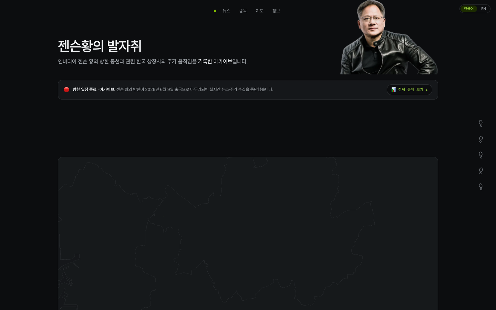
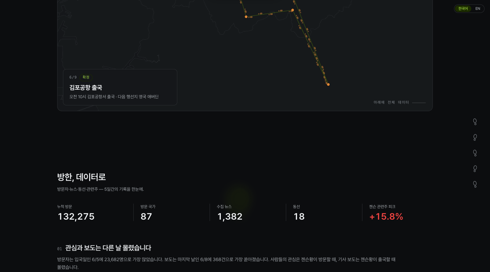
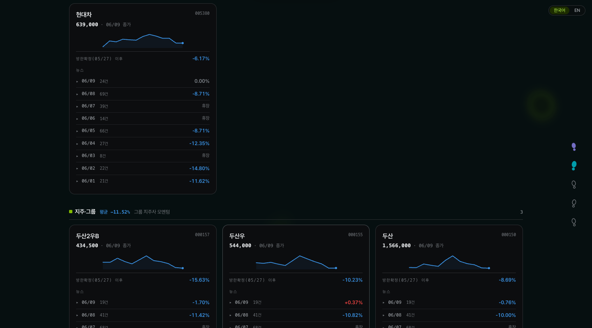
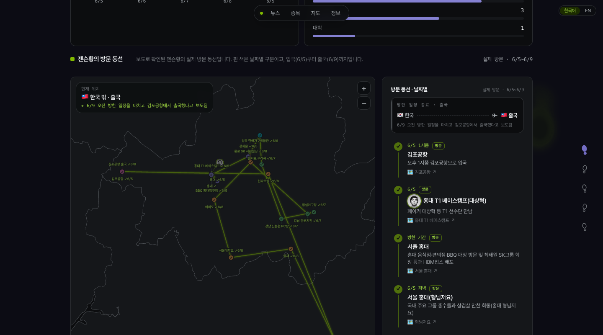
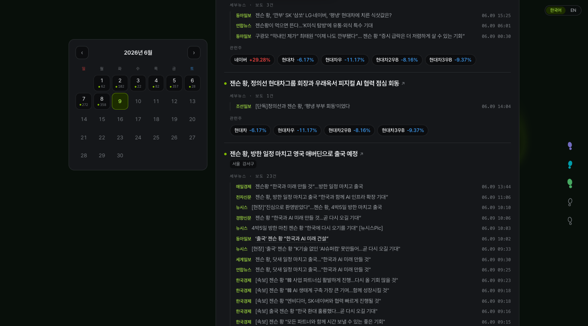

# Jensen Huang KR Tracker — 기술 스택 & 구현 레퍼런스

> 원본: https://junresearch.com/jensenHuangKRTracker  
> 분석일: 2026-06-18 (Playwright CLI + 네트워크 분석)  
> 제작자: Jun (@FourPillars / @Decipher)

젠슨 황 방한(2026.6.5-6.9) 기간의 뉴스·주식·방문지·방문자 데이터를 실시간으로 수집하다가, 일정 종료 후 완전 정적 아카이브로 전환한 **뉴스-금융-지도 복합 데이터 시각화 사이트**.

---

## 스크린샷

### 히어로 + 타임라인 캔버스


### 통계 대시보드 + KPI


### 종목 카드 + 미니 차트


### 방문 루트 지도


### 캘린더 뉴스 아카이브


---

## 1. 확정 기술 스택 (Playwright 네트워크 분석 기반)

### 프론트엔드 프레임워크

| 기술 | 확정 근거 |
|------|---------|
| **Next.js 15 (App Router)** | `_next/static/chunks/` URL 패턴, `_rsc=` 쿼리 파라미터 (React Server Components), `useRouter`/`usePathname` 훅 |
| **Turbopack** | 청크명에 `turbopack-01g7-rvema_iv.js` 포함 — Next.js 15 기본 번들러 |
| **React 18+** | RSC + Client Components 혼용, 상태 기반 날짜 필터·언어 토글 |
| **TypeScript** | 금융·지도 데이터 타입 안전성, 청크 구조 |

### 스타일링

| 기술 | 확정 근거 |
|------|---------|
| **Tailwind CSS v4** | 클래스 패턴 `flex flex-col bg-paper text-ink`, CSS 커스텀 속성이 `lab()` 색공간 사용 (`lab(3.69645% -.306115 -1.11712)` = 거의 검정), Tailwind v4의 `@theme` 기반 토큰 |
| **CSS 커스텀 디자인 토큰** | `--color-paper`, `--color-ink`, `--ease-out`, `--ease-in-out`, `--dur-1/2/3`, `--z-nav`, `--z-popover`, `--z-gate` 등 시맨틱 변수 |
| **다크 테마** | `--color-paper`는 거의 검정, `--color-ink`는 밝은 흰색 — 기본이 다크 모드 |

### 폰트

| 기술 | 확정 근거 |
|------|---------|
| **Pretendard Variable** | `cdn.jsdelivr.net/gh/orioncactus/pretendard@v1.3.9` — dynamic subset woff2 방식 로딩 확인 |

### 애니메이션

| 기술 | 확정 근거 | 담당 기능 |
|------|---------|---------|
| **GSAP** | `ScrollTrigger` 식별자 JS 청크 내 발견 | 스크롤 연동 타임라인, 섹션 진입 애니메이션 |
| **GSAP ScrollTrigger** | 동일 청크 내 `ScrollTrigger` 명시 확인 | 5일 타임라인 수평 스크롤 + 핀 제어 |
| **Framer Motion** | `framer` 식별자 JS 청크 내 발견 | React 컴포넌트 전환·진입 애니메이션 |

### 데이터 시각화

| 기술 | 확정 근거 | 담당 컴포넌트 |
|------|---------|------------|
| **Canvas API (직접)** | Canvas 4개 확인: `tc__walker`(1280×720), `fs__walk`(1102×516), `fs__trail`(1102×516), `data-engine` Canvas | 타임라인 워커 애니메이션, 네트워크 그래프 시뮬레이션 |
| **Three.js** | `WebGLRenderer`, `Scene`, `Camera`, `Mesh` JS 청크 내 발견 | Sigma.js의 WebGL 렌더링 백엔드 |
| **Sigma.js** | `sigma` 식별자 + Three.js와 동일 청크 — Sigma 2.x는 WebGL 렌더러 지원 | 관련주 연결망 (36노드 네트워크 그래프) |
| **Custom SVG 차트** | SVG 62개, 외부 차트 라이브러리 미발견, `linearGradient` SVG 확인 | 종목 카드 미니 꺾은선 차트, 스택 바 차트, 정규화 성장률 차트 |
| **SVG GeoJSON 지도** | `/geo/skorea-provinces.json` 정적 파일 로드, Leaflet 미발견 | 방문 루트 지도 (D3-geo 또는 직접 SVG path 렌더링) |
| **IntersectionObserver** | JS 청크 내 직접 사용 확인 | 섹션 진입 감지, 지연 로딩 |

### 정적 데이터 파일

| 파일 | 역할 |
|------|------|
| `/geo/skorea-provinces.json` | 한국 지도 GeoJSON (시·도 경계) |
| `/spot-bullets.json` | 젠슨 황 방문지 18곳 데이터 |

---

## 2. 인프라 & 호스팅 (확정)

| 항목 | 확정 값 | 근거 |
|------|---------|------|
| 호스팅 | **Vercel** | 청크 URL의 `dpl=dpl_F9pkgRNVaS3oJaWEUG4AjmLm2DJe` (Vercel Deployment ID) |
| 번들러 | **Turbopack** | 청크명 패턴 |
| 애널리틱스 | **Vercel Analytics** | `/ea821fcb3bc80fb1/script.js` 로드 (Vercel Analytics 스크립트 패턴) |
| DB | **없음** | 정적 JSON 파일로 대체 |

---

## 3. 백엔드 / 데이터 파이프라인 (추정)

```
[RSS 14개 매체 폴링]
      ↓ Node.js 스크래퍼 (GitHub Actions cron)
[키워드 필터] → 44.5M건 검사
      ↓
[1단계 LLM] → 빠른 모델 (Claude Haiku / GPT-4o-mini)
      ↓
[2단계 LLM] → 정밀 모델 → 1,382건 선별
      ↓
[JSON 파일 저장] → /public/data/*.json
      ↓
[네이버 금융 / KRX 스크래퍼] → 주가 JSON
      ↓
[Vercel CI/CD] → next build → 완전 정적 배포
```

---

## 4. 섹션별 UI 분석 (스크린샷 기반)

### 섹션 1: 히어로 + 타임라인 캔버스
> `screenshots/01-hero.png`

- **다크 테마** 전체 (Tailwind v4 `--color-paper` 거의 검정)
- 상단 네비게이션: 뉴스 | 종목 | 지도 | 정보 + 우상단 언어 토글 (한국어/EN)
- 젠슨 황 컷아웃 이미지 (우상단)
- 빨간 점 상태 배너: 방한 일정 종료 안내
- 우사이드바: 챕터 네비게이션 (핀 아이콘 5개)
- 하단: Canvas 기반 타임라인 (한국 지도 SVG 위에 방문 루트 점진적 애니메이션)

**핵심 구현 포인트:**
```
- GSAP ScrollTrigger로 스크롤 위치 → 타임라인 날짜 동기화
- Canvas `tc__walker`: 방문지 이동 경로 점 애니메이션
- SVG GeoJSON으로 한국 지도 outline 렌더링
```

### 섹션 2: 통계 대시보드 + KPI
> `screenshots/02-stats.png`

- 5개 KPI 카드: 누적 방문 132,275 | 방문 국가 87 | 수집 뉴스 1,382 | 동선 18 | 관련주 피크 **+15.8%** (빨간색)
- 그리드 레이아웃 (Tailwind grid)
- 큰 숫자 타이포그래피 + 레이블

**핵심 구현 포인트:**
```
- CountUp 애니메이션 (GSAP 또는 커스텀) 또는 Framer Motion
- 5분할 그리드, 구분선으로 KPI 분리
```

### 섹션 3: 종목 카드 + 미니 차트
> `screenshots/03-stocks.png`

- 종목별 다크 카드: 종목명, 종목코드, 종가, 기준일 이후 등락률
- 각 카드 내 **인라인 SVG 꺾은선 차트** (파란색 + 그라데이션 area)
- 카드 내 날짜별 뉴스 건수 + 일간 등락률 리스트
- 테마별 그룹 헤더: 지주·그룹 평균 -11.52%

**핵심 구현 포인트:**
```
- SVG viewBox 기반 커스텀 미니차트 컴포넌트 (외부 라이브러리 없음)
- linearGradient로 area 그라데이션 효과
- 확장/축소 accordion 구조 (날짜별 뉴스)
```

### 섹션 4: 방문 루트 지도
> `screenshots/04-map.png`

- 한국 지도 SVG (GeoJSON 기반) + 방문지 18핀 (날짜별 색상)
- 핀 간 연결선 (방문 순서 경로)
- 우측 패널: 방문지 목록 카드 (날짜·장소명·설명)
- 좌상단 범례 (한국/출국 플래그)
- 줌 인/아웃 버튼

**핵심 구현 포인트:**
```
- SVG path로 한국 행정구역 outline 렌더링 (D3-geo projection 또는 직접 계산)
- 핀: SVG circle + 날짜 컬러 코딩
- 연결선: SVG polyline 또는 path
- 우측 스크롤 패널과 지도 핀 상호작용 (클릭 시 스크롤 동기화)
```

### 섹션 5: 캘린더 뉴스 아카이브
> `screenshots/05-news.png`

- 좌측: 2026년 6월 달력 (날짜 클릭 → 뉴스 필터)
- 우측: 뉴스 아이템 리스트 (출처 배지, 타임스탬프, 헤드라인)
- 뉴스 그룹 헤더: 관련 종목 태그 + 주가 등락률
- 날짜별 구분 색상 (6/5=빨강, 6/6-6/9 순차)

**핵심 구현 포인트:**
```
- 커스텀 캘린더 컴포넌트 (외부 라이브러리 없이 React 상태로)
- 선택 날짜 상태 → 뉴스 필터링
- 뉴스 소스별 배지 컴포넌트
```

---

## 5. 동일 프로젝트 개발 시 권장 스택

### 설치 명령어

```bash
# 1. 프로젝트 생성 (Next.js 15 + Turbopack)
npx create-next-app@latest my-tracker \
  --typescript --tailwind --app --src-dir --turbopack

# 2. 애니메이션
npm install gsap framer-motion

# 3. 시각화 (네트워크 그래프)
npm install sigma graphology graphology-layout-forceatlas2

# 4. 지도 (GeoJSON → SVG)
npm install d3-geo d3-projection @types/d3-geo

# 5. 폰트
# HTML에 jsDelivr CDN 링크 추가 (Pretendard Variable)
```

### Tailwind v4 디자인 토큰 설정

```css
/* app/globals.css */
@import "tailwindcss";

@theme {
  --color-paper: oklch(5% 0 0);      /* 거의 검정 */
  --color-ink: oklch(95% 0 0);       /* 거의 흰색 */
  --color-accent: oklch(70% 0.2 145); /* 녹색 계열 */
  
  --ease-out: cubic-bezier(0, 0, 0.2, 1);
  --ease-in-out: cubic-bezier(0.4, 0, 0.2, 1);
  
  --dur-1: 150ms;
  --dur-2: 300ms;
  --dur-3: 500ms;
  
  --z-nav: 100;
  --z-popover: 200;
  --z-gate: 300;
}
```

### 파일 구조

```
src/
├── app/
│   ├── [locale]/
│   │   └── page.tsx              # 메인 (RSC)
│   └── layout.tsx
├── components/
│   ├── hero/
│   │   ├── HeroCanvas.tsx        # tc__walker Canvas 애니메이션
│   │   └── KoreaMapSVG.tsx       # GeoJSON → SVG 렌더링
│   ├── timeline/
│   │   └── ScrollTimeline.tsx    # GSAP ScrollTrigger
│   ├── stats/
│   │   └── KpiGrid.tsx           # 5개 KPI 카드
│   ├── stocks/
│   │   ├── StockCard.tsx         # 종목 카드 + 미니차트
│   │   └── MiniLineChart.tsx     # 커스텀 SVG 꺾은선
│   ├── map/
│   │   └── VisitRouteMap.tsx     # SVG 지도 + 핀
│   ├── network/
│   │   └── StockNetworkGraph.tsx # Sigma.js WebGL 그래프
│   └── news/
│       ├── CalendarPicker.tsx    # 커스텀 달력
│       └── NewsItem.tsx          # 뉴스 카드
public/
└── data/
    ├── geo/
    │   └── skorea-provinces.json # 한국 지도 GeoJSON
    ├── spot-bullets.json         # 방문지 18곳
    ├── news.json                 # 수집 뉴스 1,382건
    └── stocks.json               # 주가 데이터
scripts/
├── fetch-rss.ts                  # GitHub Actions 실행
├── filter-llm.ts                 # 2단계 LLM 필터
└── fetch-stocks.ts               # KRX/네이버금융 스크래퍼
```

---

## 6. 핵심 구현 패턴 요약

### 캔버스 애니메이션 (`tc__walker`)
```tsx
// 스크롤 위치 → 캔버스 프레임 동기화
useEffect(() => {
  gsap.registerPlugin(ScrollTrigger);
  ScrollTrigger.create({
    trigger: timelineRef.current,
    start: 'top top',
    end: 'bottom bottom',
    scrub: true,
    onUpdate: (self) => drawFrame(ctx, self.progress, visitPoints),
  });
}, []);
```

### 커스텀 SVG 미니차트
```tsx
function MiniLineChart({ data, width = 200, height = 60 }) {
  const xScale = (i: number) => (i / (data.length - 1)) * width;
  const yMin = Math.min(...data), yMax = Math.max(...data);
  const yScale = (v: number) => height - ((v - yMin) / (yMax - yMin)) * height;
  const pathD = data.map((v, i) => `${i === 0 ? 'M' : 'L'}${xScale(i)},${yScale(v)}`).join(' ');
  return (
    <svg viewBox={`0 0 ${width} ${height}`}>
      <defs>
        <linearGradient id="grad" x1="0" y1="0" x2="0" y2="1">
          <stop offset="0%" stopColor="#3b82f6" stopOpacity="0.3"/>
          <stop offset="100%" stopColor="#3b82f6" stopOpacity="0"/>
        </linearGradient>
      </defs>
      <path d={`${pathD} L${width},${height} L0,${height} Z`} fill="url(#grad)"/>
      <path d={pathD} stroke="#3b82f6" fill="none" strokeWidth="1.5"/>
    </svg>
  );
}
```

### Sigma.js 네트워크 그래프
```tsx
import Graph from 'graphology';
import Sigma from 'sigma';

useEffect(() => {
  const graph = new Graph();
  stockNodes.forEach(n => graph.addNode(n.id, { label: n.name, size: n.size, color: n.color }));
  edges.forEach(e => graph.addEdge(e.source, e.target, { weight: e.weight }));
  
  const renderer = new Sigma(graph, containerRef.current, {
    renderEdgeLabels: false,
    defaultEdgeColor: '#444',
  });
  return () => renderer.kill();
}, []);
```

### 정적-아카이브 전환 전략
```tsx
// 수집 기간: 실시간 fetch
// 아카이브 모드: 빌드타임 JSON 번들
// next.config.ts
const isArchived = process.env.ARCHIVE_MODE === 'true';
export default { 
  output: isArchived ? 'export' : undefined 
};
```

---

## 7. LLM 데이터 파이프라인

```
뉴스 수집 → 44,500,000건 키워드 검사
      ↓
1단계: Claude Haiku (빠른 관련도 분류)
      ↓ ~5,000건 통과
2단계: Claude Sonnet (맥락 기반 최종 선별)
      ↓ 1,382건 최종
JSON 저장 → Vercel 배포
```

**비용 최적화**: 1단계 저렴한 모델로 95% 필터 → 2단계 고성능 모델 토큰 최소화

---

## 8. 외부 서비스 목록

| 서비스 | 용도 | 비용 |
|--------|------|------|
| **Vercel** | 호스팅 + CDN + Analytics | 무료 티어 |
| **GitHub Actions** | 데이터 수집 cron | 무료 (월 2,000분) |
| **jsDelivr CDN** | Pretendard 폰트 | 무료 |
| **Anthropic API** | LLM 뉴스 필터 | 사용량 과금 |
| **네이버 금융** | 주가 데이터 | 비공식 |
| **KRX** | 일별 종가 | 무료 |
| **Google Maps** | 방문지 외부 링크 (지도 내 핀 → 구글맵) | 무료 |
