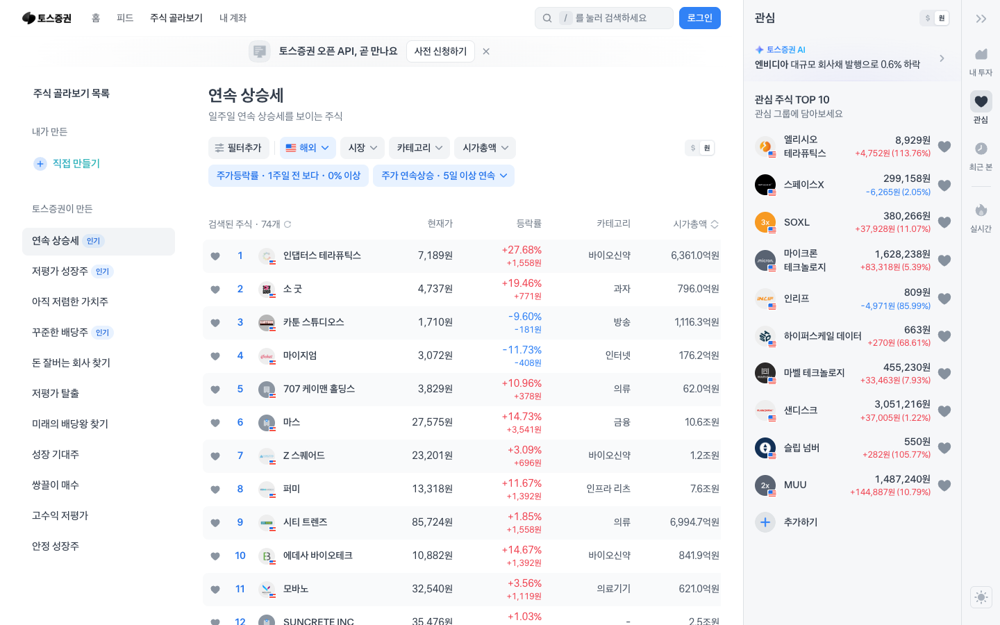
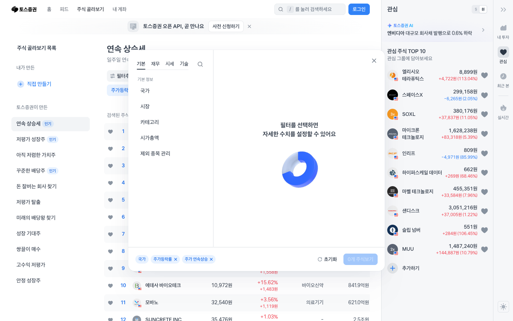
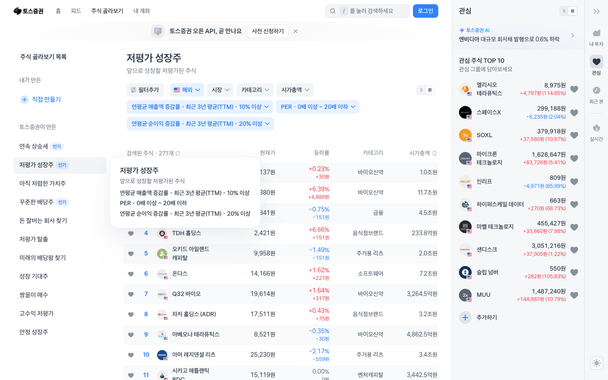
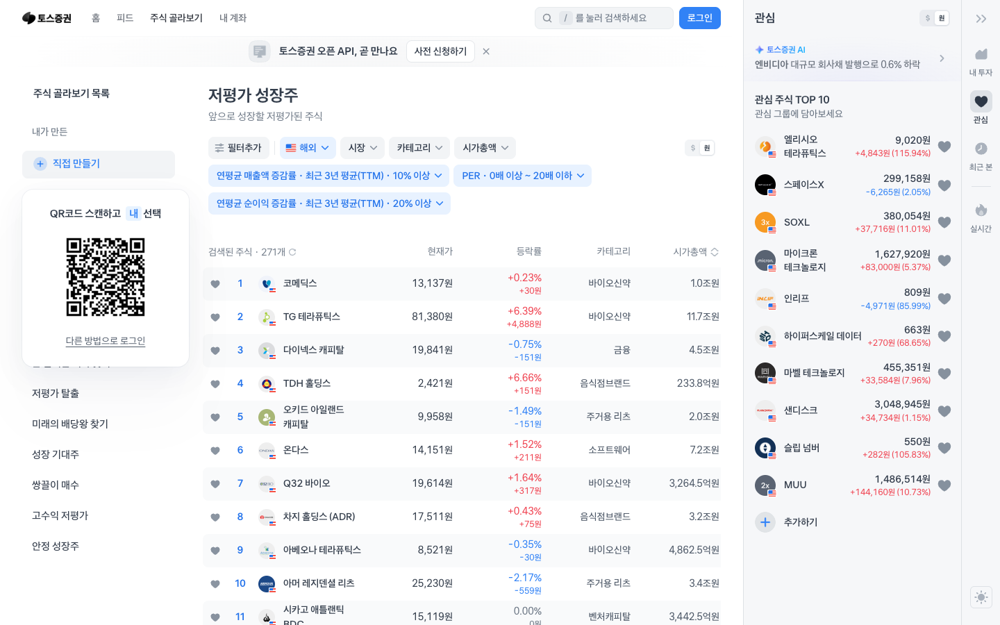

# Toss Invest Screener — 기술 스택 & 구현 레퍼런스

> 원본: https://www.tossinvest.com/screener  
> 분석일: 2026-06-18 (Playwright CLI + 네트워크 분석)  
> 제품: 토스증권 주식 골라보기

조건 필터를 조합해 종목을 스크리닝하는 **금융 데이터 필터링 UI**. 토스 자체 디자인 시스템(TDS)과 내부 @toss 패키지 기반으로 구축.

---

## 스크린샷

### 전체 레이아웃 (3단 구조)


### 필터 드로어 열린 상태


### 저평가 성장주 스크리너


### 직접 만들기 (커스텀 스크리너)


---

## 1. 확정 기술 스택

### 프레임워크

| 기술 | 확정 근거 |
|------|---------|
| **Next.js (Pages Router)** | `__NEXT_DATA__` 내 `page: "/screener"`, `pages/_app` 청크, `nextExport: true` |
| **정적 내보내기** | `nextExport: true, autoExport: true` — 서버 없이 CDN 배포 |
| **React** | `framework` 청크, 컴포넌트 기반 UI |
| **TypeScript** | 금융 데이터 타입 안전성, 토스 내부 패키지 구조 |

### 스타일링

| 기술 | 확정 근거 |
|------|---------|
| **Vanilla Extract** | CSS 클래스명 패턴 `_1k9p25g2`, `_1kestwgq` — Vanilla Extract 빌드타임 해시 방식 |
| **Toss Design System (TDS)** | `static.toss.im/tps/` 폰트, `tossface-font` 이모지 폰트 — 토스 내부 디자인 시스템 |

### 폰트

| 기술 | 확정 근거 |
|------|---------|
| **Toss Product Sans (TPS)** | `static.toss.im/tps/20260223/` — regular/medium/semibold/bold woff2 |
| **Tossface** | `static.toss.im/tossface-font/tossface.css` — 토스 자체 이모지 폰트 |

### 상태 관리

| 기술 | 확정 근거 |
|------|---------|
| **Jotai** | `jotai` — 원자 기반 경량 상태 관리 |
| **TanStack Query (React Query)** | `QueryClient`, `useQuery`, `useMutation` |
| **Redux** | `redux` — 일부 전역 상태 (레거시 또는 특정 도메인) |

### 서버 상태 / 데이터 페칭

| 기술 | 확정 근거 |
|------|---------|
| **TanStack Query v4/v5** | `useQuery`, `useInView`와 함께 무한 스크롤 패턴 |

### 애니메이션

| 기술 | 확정 근거 |
|------|---------|
| **Framer Motion** | `framer` — 페이지 전환, 드로어 애니메이션 |
| **GSAP + ScrollTrigger** | `gsap`, `ScrollTrigger` |
| **Lottie** | `lottie` — 다수 청크에서 발견, 로딩/성공 마이크로 애니메이션 |
| **Rive** | `rive` — 인터랙티브 벡터 애니메이션 |

### UI 컴포넌트

| 기술 | 확정 근거 |
|------|---------|
| **Radix UI** | `radix-ui` — 접근성 기반 헤드리스 컴포넌트 |
| **@toss 내부 패키지** | `@toss` — slash 모노레포 패키지 (use-overlay, es-hangul 등) |

### 폼

| 기술 | 확정 근거 |
|------|---------|
| **React Hook Form** | `useForm` |

### 인터섹션 / 가시성

| 기술 | 확정 근거 |
|------|---------|
| **react-intersection-observer** | `useInView` |

### 모니터링 & 분석

| 기술 | 확정 근거 |
|------|---------|
| **Sentry** | `@sentry` — 전체 70개 청크에서 발견 |
| **Amplitude** | `amplitude` — 유저 이벤트 분석 |
| **Google Tag Manager** | `GTM-WW5XV2CH` |
| **Google Analytics** | `gtag` |

### 개발 도구

| 기술 | 확정 근거 |
|------|---------|
| **MSW (Mock Service Worker)** | `msw` — 개발/테스트 환경 API 목킹 |

---

## 2. UI 구조 분석 (스크린샷 기반)

### 레이아웃: 3단 고정 분할
```
┌─────────────┬──────────────────────────┬──────────────┐
│  좌측 사이드바  │       중앙 메인 영역         │  우측 사이드바  │
│  (스크리너 목록) │  (필터 + 종목 테이블)        │  (관심종목)    │
│   ~200px    │        flex-grow         │   ~280px     │
└─────────────┴──────────────────────────┴──────────────┘
```

### 섹션별 분석

**좌측 사이드바**
- 스크리너 목록 (직접 만들기 + 토스증권이 만든 11개)
- 메뉴 아이템에 인기 뱃지 표시
- 선택된 항목 하이라이트

**중앙 메인 영역**
- 상단: 스크리너 제목 + 설명
- 필터 바: 칩(Chip) 형태 필터 태그들, 필터추가 버튼
- 종목 테이블: 종목명 | 현재가 | 등락률 | 시가총액 | 카테고리 | 공감
- 테이블 로우 hover 상태, 찜하기 아이콘
- 무한 스크롤 (`useInView` 기반)

**우측 사이드바**
- 관심 주식 TOP 10 (실시간 업데이트)
- 종목별 현재가 + 등락률 (+ 초록 / - 빨강)
- 추가하기 버튼

### 필터 드로어 (02-filter-open.png)
- 탭: 기본 | 재무 | 시세 | 기술 | 검색
- 카테고리 트리: 국가 → 시장 → 카테고리 → 시가총액 → 주가등락률 → 주가연속상승
- 하단 고정 CTA: 초기화 | 적용하기
- 배경 오버레이 + 슬라이드 인 애니메이션 (Framer Motion)

### 직접 만들기 (04-custom-screener.png)
- QR 코드 노출 (모바일 앱 연결 유도)
- 앱에서만 완전한 기능 사용 가능 안내

---

## 3. 토스 내부 패키지 (@toss/slash)

토스는 오픈소스 모노레포 [toss/slash](https://github.com/toss/slash)를 운영합니다.

| 패키지 | 역할 |
|--------|------|
| `@toss/use-overlay` / `overlay-kit` | 모달·드로어·바텀시트 선언적 관리 |
| `@toss/use-funnel` | 멀티스텝 폼 퍼널 상태 관리 |
| `@toss/es-hangul` | 한글 처리 유틸 (초성 검색 등) |
| `@toss/react` | 공통 React 유틸리티 |
| `@toss/fetch` | 타입 안전 fetch 래퍼 |

---

## 4. 디자인 패턴

### Vanilla Extract 기반 스타일링
```ts
// style.css.ts
import { style, styleVariants } from '@vanilla-extract/css';

export const chip = style({
  display: 'inline-flex',
  alignItems: 'center',
  borderRadius: 999,
  padding: '6px 12px',
  fontSize: 14,
});

export const chipVariants = styleVariants({
  default: { background: '#F2F4F6', color: '#333' },
  active:  { background: '#1B64DA', color: '#fff' },
});
```

### Jotai 필터 상태 관리
```ts
// atoms/screener.ts
import { atom } from 'jotai';

export const selectedFiltersAtom = atom<Filter[]>([]);
export const activeScreenerAtom = atom<string>('연속 상승세');
export const marketAtom = atom<'KR' | 'US'>('KR');
```

### overlay-kit 드로어
```tsx
import { overlay } from 'overlay-kit';

function openFilterDrawer() {
  overlay.open(({ isOpen, close }) => (
    <FilterDrawer open={isOpen} onClose={close} />
  ));
}
```

### TanStack Query 무한 스크롤
```tsx
const { data, fetchNextPage } = useInfiniteQuery({
  queryKey: ['screener', filters],
  queryFn: ({ pageParam = 0 }) => fetchStocks({ filters, offset: pageParam }),
  getNextPageParam: (last) => last.nextOffset,
});

const { ref } = useInView({ onChange: (inView) => inView && fetchNextPage() });
```

---

## 5. 동일 프로젝트 개발 시 권장 스택

```bash
# 프로젝트 생성
npx create-next-app@latest toss-screener-clone \
  --typescript --app --src-dir

# 스타일링
npm install @vanilla-extract/css @vanilla-extract/next-plugin

# 상태 관리
npm install jotai @tanstack/react-query

# 애니메이션
npm install framer-motion lottie-react

# UI 헤드리스
npm install @radix-ui/react-dialog @radix-ui/react-tabs

# 폼
npm install react-hook-form zod @hookform/resolvers

# 인터섹션
npm install react-intersection-observer

# 오버레이 관리
npm install overlay-kit

# 모니터링
npm install @sentry/nextjs
```

### next.config.ts 설정
```ts
import { createVanillaExtractPlugin } from '@vanilla-extract/next-plugin';
const withVanillaExtract = createVanillaExtractPlugin();

export default withVanillaExtract({
  output: 'export',  // 정적 내보내기
  assetPrefix: '/assets/v2',
});
```

---

## 6. 외부 서비스

| 서비스 | 용도 |
|--------|------|
| **Sentry** | 에러 모니터링 (전체 앱) |
| **Amplitude** | 사용자 행동 분석 |
| **Google Tag Manager** | 태그 관리 |
| **static.toss.im** | 폰트·에셋 CDN |
| **MSW** | 개발 환경 API 목킹 |
